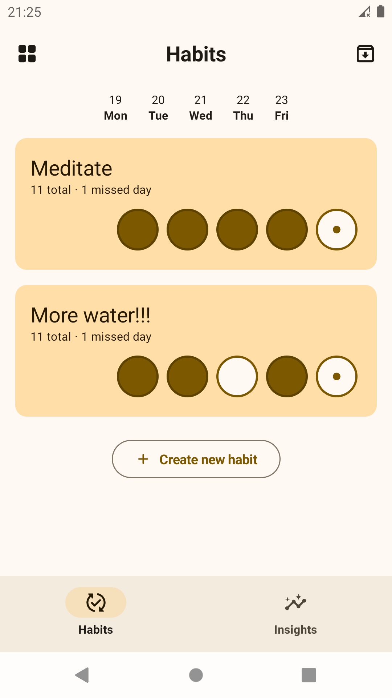
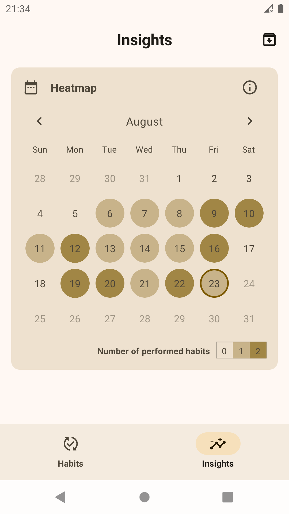
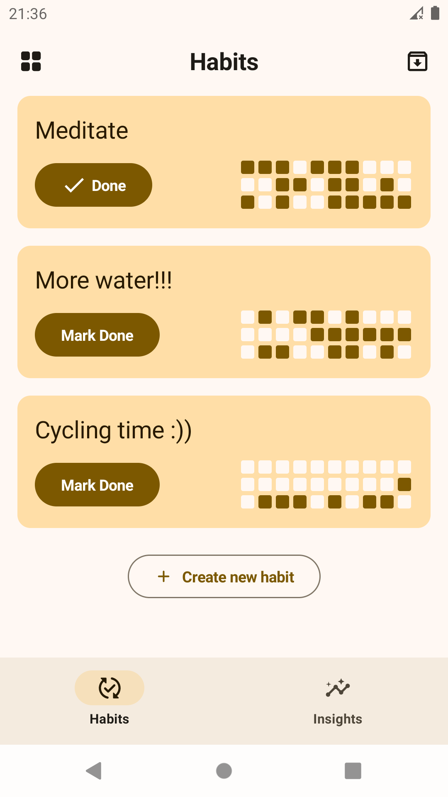
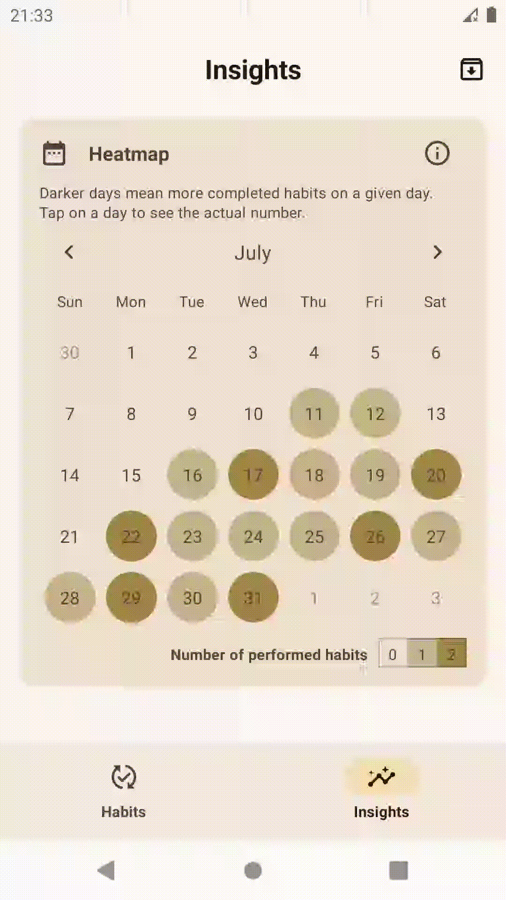
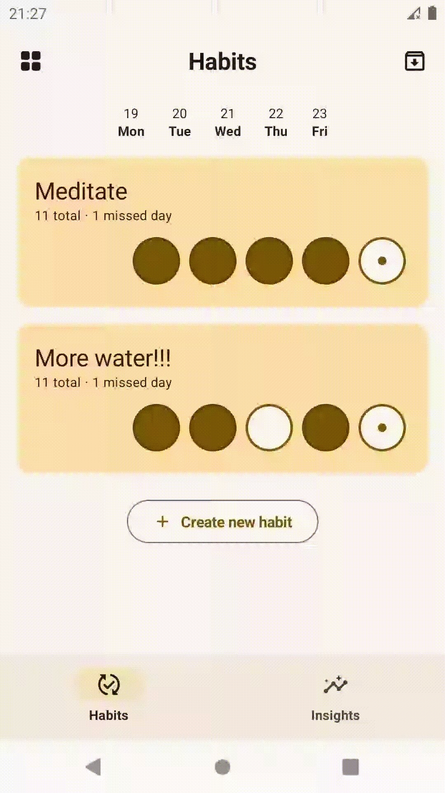

## Shukan 

**Shukan** is a minimalist habit tracker built using *Kotlin* with *Jetpack Compose* and [*Room*](https://developer.android.com/training/data-storage/room). 

[**Check out the Demo**]() 🌱

### Features

| **Streak Tracking 📈**                                        | **Heatmap 📊**                                                     | **Mini Calendar 📅**                                            |
|---------------------------------------------------------------|--------------------------------------------------------------------|-----------------------------------------------------------------|
| Easily track and maintain your habit streaks.                 | Visualize your progress with a heatmap.                            | Quickly view your habits with a mini calendar.                  |
|     |          | |
